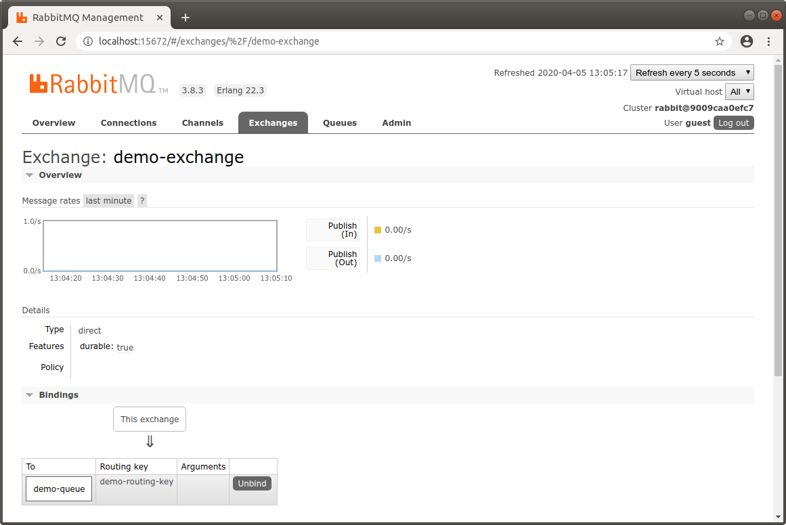
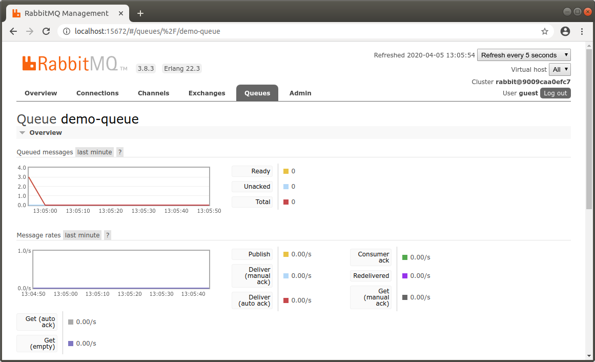
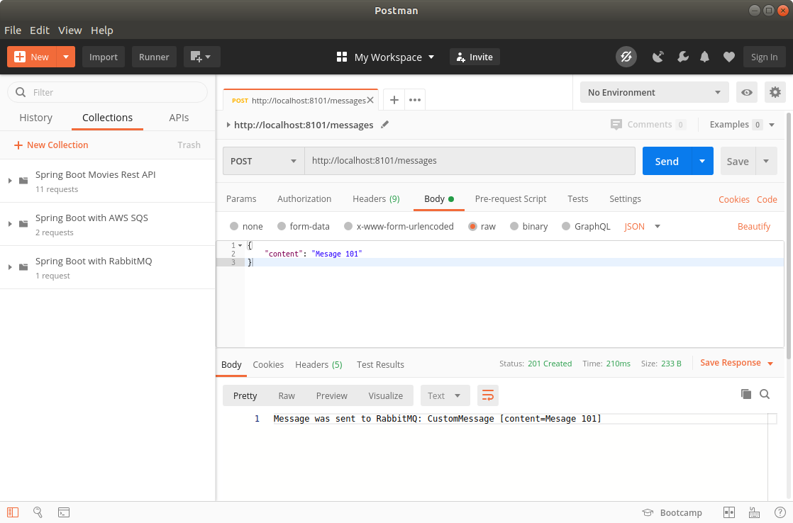
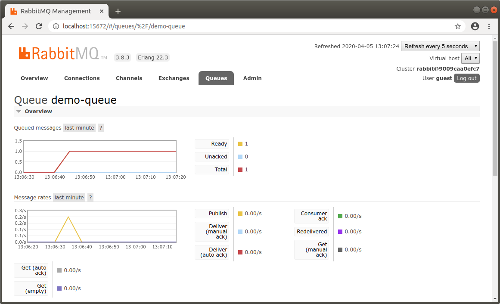

SPRING BOOT PRODUCER
----------------------------------------------------------------------------------------------------

Proyecto Spring Boot que envia mensajes a cola en RabbitMQ.

Los mensajes enviados son procesados por la aplicación "Consumer":

**SPRING BOOT CONSUMER**

https://github.com/edgar-code-repository/spring-boot-rabbit-consumer

----------------------------------------------------------------------------------------------------

**Dependencia para conectar a RabbitMQ:**

```

	<dependency>
		<groupId>org.springframework.boot</groupId>
		<artifactId>spring-boot-starter-amqp</artifactId>
	</dependency>

```

----------------------------------------------------------------------------------------------------

**Exchange generado por la aplicacion en RabbitMQ:**



----------------------------------------------------------------------------------------------------

**Cola generada por la aplicacion en RabbitMQ:**



----------------------------------------------------------------------------------------------------

**Mensaje enviado desde Postman a rest endpoint:**



----------------------------------------------------------------------------------------------------

**Mensaje recibido por RabbitMQ:**



----------------------------------------------------------------------------------------------------